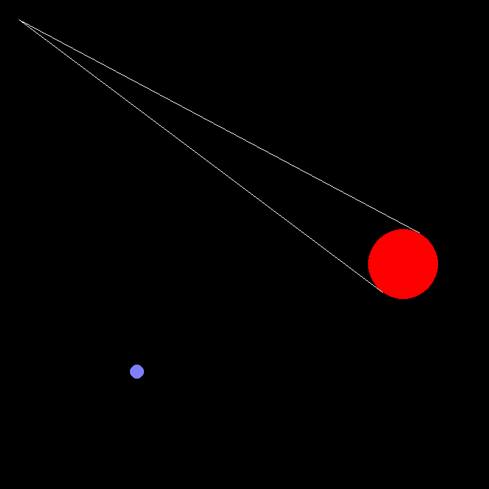

# chess 
  

- [Features](#features)
- [About the project](#about-the-project)
- [Installation](#installation)
- [Dependencies](#dependencies)
- [Upcoming features](#upcoming-features)
- [Files](#files)
## features
* **Kepler** motion included.
* **Orbit** motion included.
* **Multiple** stars orbiting simultaneously.
* **Transit graph** presented in contrast to the simulation.
## about the project
  
The purpose of this project is to visualize transit and make predictions about transits. 
The main purpose that will be achieved in the future is to **reverse** the process. 
## installation
There are two ways to install this project :
1. Download project from GitHub.
2. Open in pycharm and install dependencies.
3. Run and experiment!
## dependencies
the dependencies of this project are :
* [Pycharm Community Edition](https://www.jetbrains.com/pycharm/)
* [Pygame Graphics Library](https://www.pygame.org/docs/ref/draw.html)
* [Matplotlib Visualizations Library](https://matplotlib.org/stable/)
* [Shapely Library](https://shapely.readthedocs.io/en/stable/manual.html)
## upcoming features
* Live graph in contrast to simulation
## files
* assets - folder containing the assets.
* main.py - main program file.
* observer.py - observer object file.
* planet.py - planet object file.
* README.md - readme file for GitHub.
* todo-list.txt - things to do in the future.